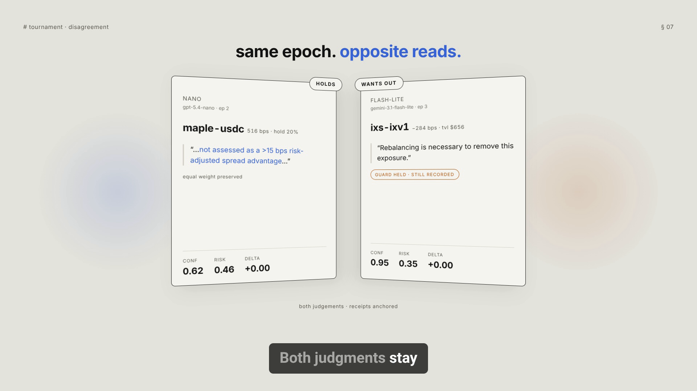

<p align="center">
  
</p>

<p align="center">
  <b>An autonomous RWA treasury agent that decides where capital should sit —<br />
  and proves it decided before it knew the outcome.</b>
</p>

<p align="center">
  SERV Hackathon Edition 01 · <b>RWA Vaults track</b> · partner: IXS Finance
</p>

> *"Your agent says it made good calls. How would I know it didn't write that log afterwards?"*

---

## Demo

<p align="center">
  <a href="docs/demo.mp4">
    
  </a>
</p>

<p align="center">
  <video src="docs/demo.mp4" controls width="960" muted playsinline preload="metadata"></video>
</p>

<p align="center">
  <a href="docs/demo.mp4"><b>▶ Watch the demo</b></a>
  · 3:27 · 1920×1080 · autonomous tournament, receipts, onchain proof
</p>

---

## The idea in one minute

You hold a company's idle cash. Tokenized treasury bills pay 3.8%. Private credit
pays 5.2% but can default. The rates move daily, someone has to keep choosing,
and that someone has to justify every choice to whoever owns the money.

VAULT-PILOT does that on its own clock, forever. It reads what vaults are
actually paying right now, weighs yield against risk, moves the allocation, and
writes down what it did and why.

The interesting part is the proof.

Any agent can produce a log claiming good decisions. You cannot tell afterwards
whether it was written honestly at the time or assembled once the results were
in. So every decision here is fingerprinted, and the fingerprint is published to
a public blockchain **immediately — before anyone knows how it turns out.**

That timestamp is the product. It turns *"trust our logs"* into *"check the
chain yourself"*:

```bash
python3 scripts/verify.py --all --rpc
```

No dependencies, no account. It recomputes every fingerprint, fetches the
matching transaction, and compares byte for byte. Edit one number in one receipt
afterwards and the check fails loudly.

---

## Architecture

An **arm** is one contender in the model tournament — a single model (or a
model + its shadow-validation pair) answering the same decision each epoch.
The UI, leaderboard, and API all use “arm” for that unit.

```
                         ┌──────────────────────────┐
                         │         Browser          │
                         │  tournament · receipts   │
                         │        · policy          │
                         └────────────┬─────────────┘
                                      │  JSON over HTTP
                         ┌────────────┴─────────────┐
                         │     API  (+ ui/dist)     │
                         │  /preflight  /leaderboard│
                         │  /receipts   /yields     │
                         │  /models     /policy     │
                         └────────────┬─────────────┘
                                      │
                         ┌────────────┴─────────────┐
                         │        SCHEDULER         │
                         │  decides on its own      │
                         │  clock; never overlaps   │
                         │  a run already in flight │
                         └────────────┬─────────────┘
                                      │  one epoch
              ┌───────────────────────┴───────────────────────┐
              │                 EPOCH RUNNER                  │
              └───┬───────────┬───────────┬───────────┬───────┘
                  │           │           │           │
            ① READ      ② REASON     ③ GUARD     ④ RECORD
                  │           │           │           │
    ┌─────────────┴──┐  ┌─────┴──────┐  ┌─┴────────┐ ┌┴──────────────┐
    │ IXS vault      │  │ SERV       │  │ policy   │ │ receipt       │
    │ ERC-4626 read  │  │ N arms,    │  │ enforced │ │ pre/post,     │
    │ convertTo      │  │ identical  │  │ in code: │ │ rationale,    │
    │ Assets()       │  │ snapshot,  │  │ caps,    │ │ confidence,   │
    │ on BNB Chain   │  │ forced     │  │ spread,  │ │ cost, guards  │
    ├────────────────┤  │ submit_    │  │ unknown  │ └┬──────────────┘
    │ public yield   │  │ decision   │  │ vaults,  │  │
    │ index: BUIDL,  │  │ tool call  │  │ NaN,     │  │ SHA-256
    │ USDY, Maple,   │  └─────┬──────┘  │ negative │  │
    │ Centrifuge     │        │         └─┬────────┘  │
    └────────────────┘        │           │      ┌────┴──────────────┐
                              │           │      │   ⑤ ANCHOR        │
                     ┌────────┴───┐  violation   │ zero-value        │
                     │ gpt-5.4-   │  → hold      │ self-send,        │
                     │ mini       │  previous    │ hash as calldata  │
                     │ + shadow   │  allocation  │                   │
                     │ claude-    │              │ block timestamp = │
                     │ haiku-4.5  │              │ proof of          │
                     │ gemini-    │              │ precedence        │
                     │ 3.5-flash  │              │                   │
                     └────────────┘              └────┬──────────────┘
                                                      │
                                                      ▼
                                            ┌──────────────────┐
                                            │    verify.py     │
                                            │  stdlib only     │
                                            │  recompute hash  │
                                            │  fetch tx        │
                                            │  compare bytes   │
                                            └──────────────────┘

    ─────────────────────────────────────────────────────────────────
     SETTLEMENT (opt-in, manual, real funds — the scheduler cannot)
     pnpm settle deposit N  →  ERC-4626 deposit into the IXS vault
    ─────────────────────────────────────────────────────────────────
```

---

## Getting started

### Prerequisites

- Node 20+ with pnpm
- Python 3.9+ (verification only — standard library, nothing to install)
- One API key for an OpenAI-compatible reasoning endpoint

### Run it

```bash
pnpm install
cp .env.example .env     # add SERV_API_KEY
pnpm dev                 # agent + interface, one command
```

Open <http://localhost:5173>. The agent starts thinking within seconds and keeps
going. You are not required to press anything.

If something is missing — no key, unfunded wallet — the interface says so in
plain language *before* running, rather than failing halfway through.

### Enable onchain proof

```bash
pnpm wallet:new          # generates a throwaway anchoring key
                         # fund the printed address with testnet gas
pnpm wallet:status       # confirms balance and chain
```

The anchoring wallet only ever signs zero-value transactions carrying a hash.
It never holds treasury capital.

### Deploy — one process, everything autonomous

The production shape is a **single process**: it serves the built interface,
the JSON API, and the epoch scheduler. Visitors see the site; the scheduler
keeps deciding, anchoring, and writing receipts on its own clock — no second
service, no manual triggers.

```bash
pnpm build:all      # compile agent + build the interface once
# in .env:  API_HOST=0.0.0.0   and  ANCHOR_PRIVATE_KEY=…  for onchain proof
pnpm start          # site + API + autonomous scheduler on one port
```

Open `http://<host>:8787` — deep links (`/receipts`, `/policy`) work on
reload, and the leaderboard updates as epochs land. Local development still
uses `pnpm dev` (Vite on 5173 proxying `/api` to the agent).

The site needs a **persistent** host (VPS, Fly, Railway, a long-lived VM):
receipts live on disk and the scheduler must survive restarts. Static-only
hosts cannot run the loop.

Two things a host must provide, or the record breaks:

- **A writable disk.** Point `RECEIPTS_ROOT` and `IXS_HISTORY_PATH` at it.
  Without persistence, every redeploy erases every receipt and the tournament
  restarts at epoch 1.
- **A process that stays up.** Receipts are gitignored, so a fresh deploy
  begins with an empty tournament and builds its own record. The IXS vault
  reports `apyKnown: false` until enough share-price observations have
  accumulated — the same cold start any new checkout has.

Serverless platforms (Vercel, Netlify Functions, Cloudflare Workers) cannot
host this: there is no process between requests to run the scheduler, function
runtimes cap out well below an epoch, and there is no writable disk for the
receipts.

---

## How one decision is made

**① Read what vaults actually pay.** The IXS vault is read straight off BNB
Chain — asking the contract what one share is worth. The rest come from a public
yield index. Nothing is invented; there is no synthetic data in this project.

**② Reason.** Each arm — one model’s run of this decision — gets identical
numbers and must answer in a fixed shape:
target allocation, rationale, confidence, risk score. It is asked to weigh three
things a naive optimiser ignores:

- **credit risk** — private credit pays more because it can default
- **concentration** — a vault holding $656 cannot absorb $200,000
- **uncertainty** — a new vault has no track record, and is told so honestly
  rather than handed a fake 0%

**③ Check against the rules.** The policy is enforced twice: once as
instructions, once in code afterwards. The second is authoritative.

> **A model cannot argue with the guard chain.** Confidence 0.99 is not a
> credential. A rejected decision holds the previous allocation, and the receipt
> records exactly what was attempted. Failed attempts are kept, not hidden.

**④ Record.** Before/after allocation, observed yields, reasoning, cost, guard
verdict.

**⑤ Anchor.** The fingerprint goes onchain, before the outcome exists.

---

## Why several models at once

Every **arm** is a separate model (or model + shadow pair) running the same
decision on the same data every epoch — not to crown a winner, but because
**disagreement is the signal.** One real epoch:

> **nemotron-super** kept 20% in the new IXS vault and moved toward
> higher-yielding private credit. Risk score 0.6.
>
> **nemotron-ultra** cut it to 5%: *"TVL of only $656, implying >30% ownership
> concentration and zero observed yield history"* — a liquidity risk regardless
> of headline rate. Risk score 0.35.

*These nemotron arms (and a few other free open-source models) were used for
testing only. The tournament runs every epoch — multiply that by four arms and
the bill is real — so free models keep development and demos affordable. Point
`TOURNAMENT_MODELS` at paid arms when you want the leaderboard to score them.*

Neither is obviously wrong. You can watch how differently models weigh risk when
the answer is not obvious, and every judgement is on the record.

### What the leaderboard actually ranks

**Held edge over the equal-weight baseline**, time-weighted.

For each receipt, the arm's allocation and an equal-weight allocation across
every policy vault are both priced on that receipt's own yield snapshot; the
gap is that epoch's edge. Each edge is weighted by how long the allocation was
actually held — from that receipt until the next one, and for the newest
receipt until now.

Two properties that matter, and one honest limitation:

- **Holding is scored.** An arm parked in a good allocation keeps earning its
  edge every epoch. The obvious alternative — summing each epoch's improvement
  over the previous allocation — scores *rebalancing events*, so an arm that
  makes one good move and then correctly sits still scores zero forever, and
  the standings freeze after epoch one.
- **Epoch count does not decide it.** Dividing by held time makes an arm with
  three receipts directly comparable to one with thirty. Arms lose epochs to
  upstream model outages, which is not a quality worth ranking.
- **Most of the edge comes from what an arm refuses to hold.** The baseline
  includes every vault at equal weight, a bleeding one included. A large
  positive number is often avoidance, not selection — read it next to
  `current_yield_bps`.

`cumulative_yield_delta_bps` is still on every row and still checked by
`verify.py`; it is simply no longer the ranking key.

Cost per decision and rule-compliance sit beside the ranking. An agent that
earns more by breaking rules more often is not better, and the table refuses
to hide that.

---

## API

| Method | Path | Description |
|---|---|---|
| `GET` | `/api/health` | Liveness and whether anchoring is on |
| `GET` | `/api/preflight` | What is configured, what blocks a run |
| `GET` | `/api/policy` | Allocation rules, vault set, tournament arms |
| `GET` | `/api/yields` | Live APY and TVL per vault |
| `GET` | `/api/receipts` | Signed receipt log, optionally `?model=` |
| `GET` | `/api/leaderboard` | Arm rankings |
| `GET` | `/api/models` | Models the endpoint serves, `?free=true` |
| `GET` | `/api/epoch/status` | Current run, step log, next scheduled run |
| `POST` | `/api/epoch/run` | Extra epoch on demand (needs `OPERATOR_TOKEN`) |

The API defaults to loopback and allows one cross-origin UI origin
(`UI_ORIGIN`). When the API serves the built interface itself, same-origin
requests need no configuration. The only state-changing route requires a token
and is closed unless one is set — the scheduler is the normal driver, so
nothing is lost by keeping it shut.

## Environment

| Variable | Default | Description |
|---|---|---|
| `SERV_API_KEY` | — | Key for the reasoning endpoint |
| `SERV_BASE_URL` | `inference-api.openserv.ai/v1` | Any OpenAI-compatible endpoint |
| `TOURNAMENT_MODELS` | 4 arms | Contenders: `id:model:shadow:inPrice:outPrice` (see Architecture) |
| `SERV_TOOLS` | auto | Force `serv_*` tool support `on`/`off` |
| `EPOCH_INTERVAL_SECONDS` | `3600` | How often it decides (floor 30) |
| `EPOCH_SCHEDULER` | on | `off` stops epochs, API stays up |
| `TREASURY_EQUITY_USD` | `1000000` | Notional treasury size |
| `ANCHOR_PRIVATE_KEY` | — | Enables onchain anchoring |
| `ANCHOR_CHAIN_ID` | `84532` | 84532 / 11155111 / 421614 / 97 |
| `SETTLEMENT_PRIVATE_KEY` | — | Enables **real** IXS settlement |
| `SETTLEMENT_MAX_PER_TX` | `10` | Ceiling per settlement transaction |
| `OPERATOR_TOKEN` | — | Required for manual epoch triggering |
| `API_HOST` / `API_PORT` | `127.0.0.1` / `8787` | API bind. `API_PORT` unset falls back to `PORT` |
| `UI_ORIGIN` | `http://localhost:5173` | Cross-origin UI allowed to read the API (same-origin needs none) |
| `RECEIPTS_ROOT` | `receipts` | Where signed receipts are written |
| `IXS_HISTORY_PATH` | `data/ixs-share-price-history.json` | IXS share-price observations |
| `NET_CONNECT_ATTEMPT_TIMEOUT_MS` | `5000` | Per-address TCP handshake budget |

---

## Honest about what is real

> **The capital is notional. The yields, the reasoning, the rule enforcement,
> and the timestamps are real.**

`TREASURY_EQUITY_USD` is a number, not a funded account. `settlement_mode:
"accounting"` means no tokens moved — it does **not** mean the data was fake.

**Real settlement works.** The IXS vault accepts deposits from anyone — verified
against the contract, not assumed:

```
maxDeposit(any address) = unlimited       deposits open
paused()                = false
previewDeposit(100)     = 91.646260 shares
```

No Agent Rail, no OAuth, no KYC. So this performs a genuine ERC-4626 deposit:

```bash
pnpm settle status            # position, balances, deposits open?
pnpm settle deposit 5         # real deposit
pnpm settle redeem 4.5        # real redemption
```

It is deliberately **not** automatic. IXS publishes no testnet vault, so this is
mainnet. The scheduler cannot settle. There is a per-transaction ceiling. You
opt in with a key, or it does not happen.

---

## Layout

```
src/
  scheduler.ts          decides on its own clock, never overlapping
  epoch-runner.ts       read → reason → guard → record → anchor
  api.ts                read API + status + serves ui/dist
  run-state.ts          in-process progress for status/UI polling
  net-tuning.ts         wider TCP handshake budget for flaky links
  vaults/
    ixs-source.ts       reads IXS vaults off BNB Chain
    ixs-settlement.ts   real deposits / redemptions (opt-in)
    yield-source.ts     public index for non-IXS vaults
  reasoning/
    guard-chain.ts      caps + spread; the rules a model cannot argue with
    policy-graph.ts     the contract every model must fill in
    serv-client.ts      forced tool call, serv_* tools when supported
    model-configs.ts    TOURNAMENT_MODELS → one entry per arm
    model-catalogue.ts  what the endpoint will actually serve
  storage/
    receipts.ts         canonical JSON + SHA-256
    anchor.ts           publishing fingerprints onchain
    leaderboard.ts      rankings across arms
  config/policy.yaml    caps, spread threshold, pinned vault set
scripts/
  verify.py             the check anyone can run
  settle.ts             manual real settlement
  benchmark.py          agent vs. equal-split baseline
  start.mjs             production entry: UI + API + scheduler
  dev.mjs               local entry: API + Vite together
ui/                     the interface
```

## Checks

```bash
pnpm test              # 59 tests
pnpm verify:onchain    # every receipt, against the chain
pnpm benchmark         # agent vs. baseline
```

Fingerprinting is implemented twice — TypeScript writes receipts, Python
verifies them — and a test pins both to the same digest so they cannot silently
drift apart.

---

## Design principles

1. **No synthetic data.** Every number is read from a live source. A vault
   without enough history reports *unknown*, never a convenient zero.
2. **Rules live in code, not in prompts.** Prompt instructions are a courtesy;
   the guard chain is the contract.
3. **Rejections are evidence.** A blocked decision is recorded with what it
   tried, because that is when the guards are doing their job.
4. **Precedence over reputation.** A log proves nothing. A hash in a block
   before the outcome proves something specific.
5. **Real money is opt-in and manual.** The autonomous loop can read the world
   and commit to decisions; it cannot spend.
6. **Say what is notional.** Once, plainly, in the README and the interface.

## Where it stops

The agent reads IXS vaults for real and can settle into them for real. What it
does not do is settle *automatically* — that would mean an unattended process
moving mainnet funds, which is not something to ship in a week.

Anchoring runs on a testnet: the timestamp carries the meaning, and a testnet
block proves precedence exactly as well as a mainnet one.
